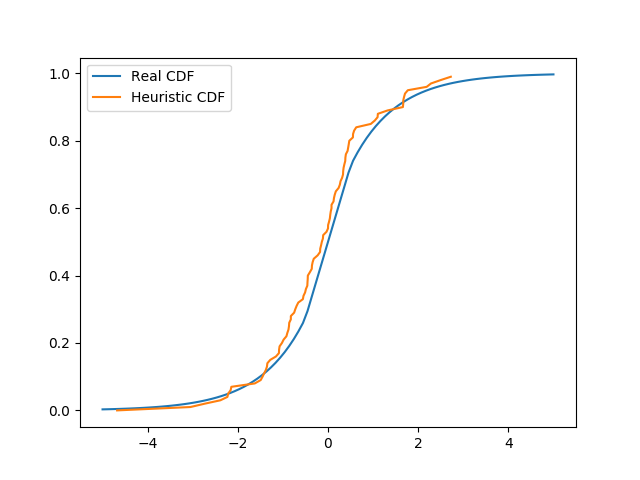

# mathstat-hw-simulation
Homework for math statistics course in HSE

## Results

See the code in [hw11.py](hw11.py).

Here are the plots for sample size 100:

Inverse functions method:

Filtration method:

